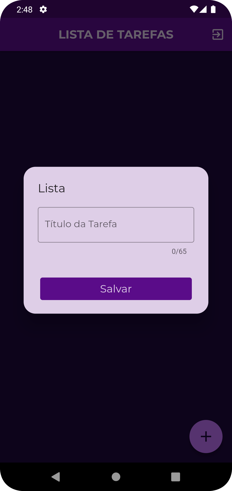

    

## To-Do List App

To-Do List é um aplicativo construído em Flutter que permite aos usuários armazenar e organizar suas tarefas de forma simples e eficiente. O aplicativo utiliza a arquitetura MVC (Model-View-Controller) para uma estrutura de código organizada e escalável, proporcionando uma experiência de usuário intuitiva. Além disso, o To-Do List é um aplicativo CRUD (Create, Read, Update, Delete), o que significa que os usuários podem criar, editar, atualizar e excluir suas tarefas com facilidade, oferecendo maior flexibilidade e controle sobre suas listas de afazeres.

### Funcionalidades Principais
- Cadastro e Login de Usuários: Os usuários podem se cadastrar e fazer login em suas contas para acessar suas listas de tarefas.
- Criação e Edição de Tarefas: É possível adicionar novas tarefas à lista, atribuindo-lhes uma descrição, uma data de conclusão, bem como editar as tarefas existentes conforme necessário.
- Exclusão de Tarefas: Os usuários podem remover tarefas concluídas ou que não são mais relevantes.
- Integração com Firebase: O aplicativo utiliza o Firebase para armazenar e sincronizar dados do usuário, proporcionando uma experiência segura e confiável.

### Tecnologias Utilizadas

- Flutter: Framework multiplataforma para desenvolvimento de aplicativos móveis nativos.
- Dart: Linguagem de programação utilizada pelo Flutter.
- Modular: Framework que oferece uma arquitetura modular para o desenvolvimento de aplicativos.
- MobX: Biblioteca de gerenciamento de estado reativo.
- Firebase: Plataforma de desenvolvimento de aplicativos móveis do Google.
## Demonstração

## Contribuindo

Contribuições são bem-vindas! Sinta-se à vontade para abrir uma issue para relatar bugs, solicitar novas funcionalidades ou enviar pull requests com melhorias para o projeto.